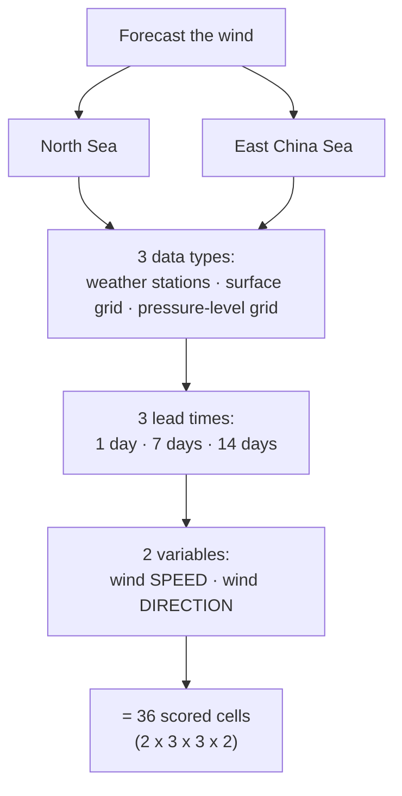
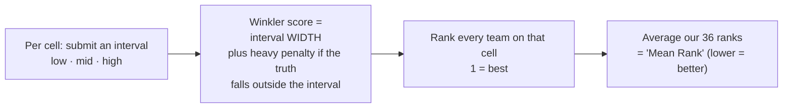
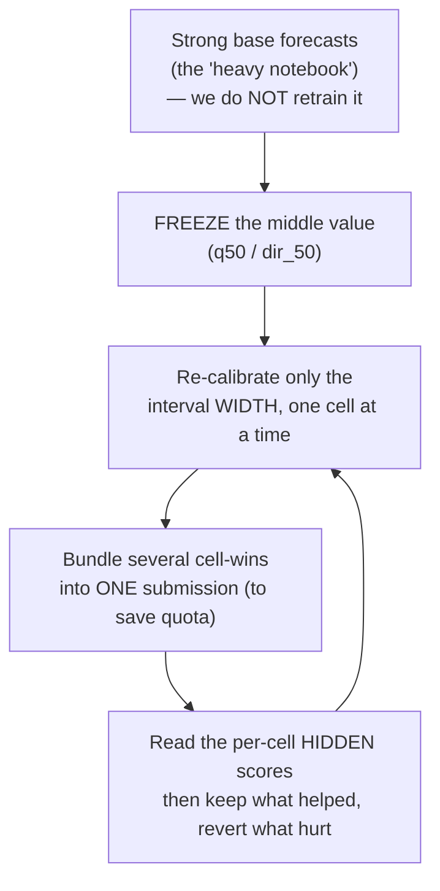
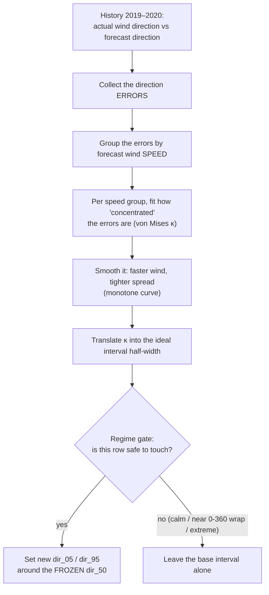
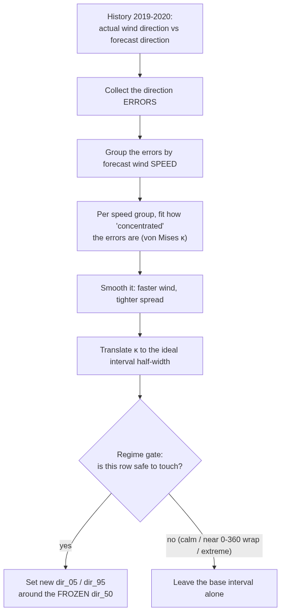
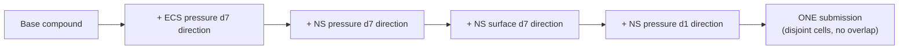
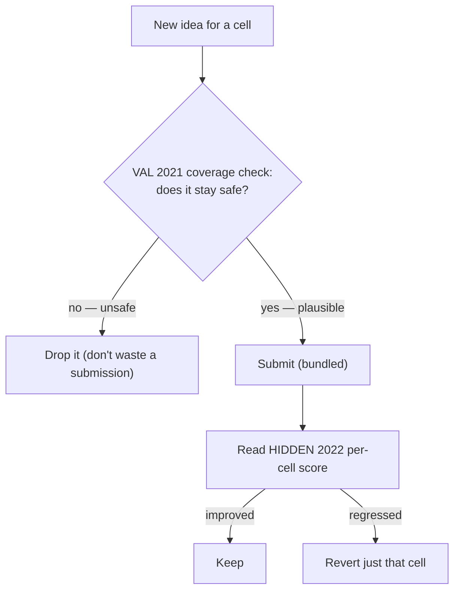
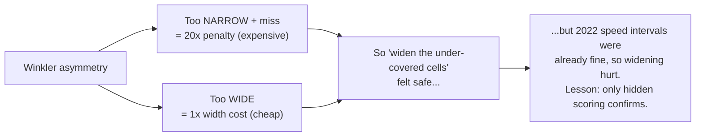
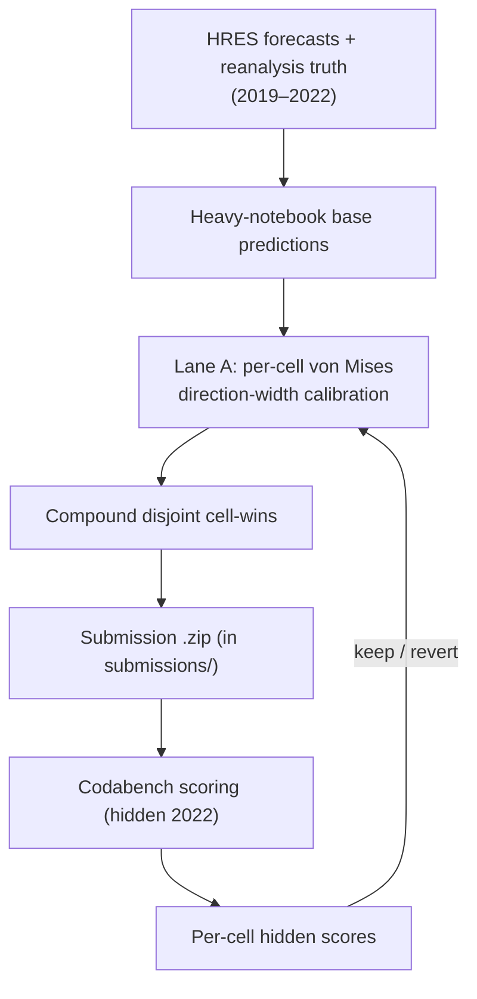

# Sea Winds — Methodology & Approach

A plain-English overview of how we got to **#1** on the Sea Winds wind-forecasting
competition (Codabench Phase 1), followed by the technical detail.

> **One-sentence summary:** We start from a strong set of baseline forecasts, leave the
> predicted *values* untouched, and instead **re-calibrate the uncertainty intervals
> around them — one cell at a time** — using a small, statistically-grounded model, then
> let the live leaderboard tell us which changes actually helped.

---

## 1. The problem, in plain terms

We forecast **wind speed** and **wind direction** for two sea regions, at three lead
times, from three kinds of measurements. Every combination is scored separately — there
are **36 scored "cells."**

For each cell we don't submit a single number — we submit an **interval**: a low, a
middle, and a high estimate (the 5th, 50th, 95th percentiles). Speed uses
`q05 / q50 / q95`; direction uses `dir_05 / dir_50 / dir_95` (angles).

### How scoring works (this shaped every decision)

Two facts drive everything:

1. **The Winkler score is asymmetric.** A too-*wide* interval costs a little (you pay the
   extra width). A too-*narrow* interval that misses the truth costs **20×** as much (the
   miss penalty). So when in doubt, it is safer to be slightly wide.
2. **The leaderboard ranks per cell, then averages the ranks.** So a *tiny* score gain on
   a crowded cell can flip several rank positions, while a *huge* gain on a cell where one
   rival is far ahead can buy nothing. **We always reason in ranks, not raw scores.**

---

## 2. The core strategy

The baseline forecasts (from a heavy "kitchen-sink" notebook) already have good *center*
predictions. Re-training that model for the 2022 test year kept making things **worse**
(more on that below). So our whole approach is:

**Why freeze the center?** Moving the predicted value is high-risk — it can be wrong in a
new year. Changing only the interval width is low-risk and directly targets the Winkler
score. This "center-frozen, width-only" rule is the backbone of every method below.

---

## 3. The methods — main idea first, then detail

### 3.1 Lane A — von Mises direction-width calibration *(our biggest winner)*

**Main idea in one breath:** *When the wind blows hard, its direction is steady and
predictable; when it's calm, the direction wanders. So we learned, from history, exactly
how wide the direction interval should be as a function of wind speed — and resized our
direction intervals to match.*

*(Static render above for viewers without Mermaid support; SVG versions of this and the
validate/iterate loop are in [`docs/img/`](img/).)*

**Detail.** For each cell we pool the 2019–2020 training rows, compute the angular error
`actual − forecast`, bin those errors by the HRES forecast wind speed, and fit a **von
Mises** concentration parameter **κ** per bin (the circular analogue of a Gaussian's
precision). We make κ a monotone (isotonic) function of speed, then convert it to a 90%
half-width via `vonmises.ppf(0.95, κ)`. At inference we look up κ from the forecast speed
and set `dir_05 / dir_95 = dir_50 ± half-width`. A **regime gate** reverts rows that are
risky (very low speed, direction near the 0°/360° wrap, or where the change would be
extreme).

**Results (hidden 2022):** Lane A won on the pressure-level d7 direction cells
(East China Sea **−4.05**, North Sea **−7.94** Winkler) and on North Sea surface d7
direction (**−5.95**). These flips moved us up the leaderboard. It replaced an earlier,
cruder "speed × half-width" rule and was roughly **3× stronger**.

### 3.2 Compounding — many wins, one submission

**Main idea:** *Submissions are limited (~25 for the final stretch). Each winning change
touches a different cell, so we can stack many of them into a single submission without
them interfering.*

**Detail.** Each overlay writes only its cell's columns onto the base; a scope check
guarantees no other cell, and no frozen center, changes. Our best submission **v218**
bundles five such overlays and scores our best mean rank (~3.35, #1).

### 3.3 Reasoning in ranks, not scores

**Main idea:** *The prize is mean rank. We map, for every cell, how many points it would
take to climb one position — and only chase the cheap, winnable climbs.*

A 44-point gap on one direction cell looked huge but was **unwinnable** (one rival sits far
below the whole field, and we were already 2nd — closing part of the gap buys zero ranks).
Meanwhile several speed cells sit within **0.01–0.09 points** of the next rank. We let this
map, not raw gaps, choose targets.

### 3.4 Validation discipline — and the hard lesson

**Main idea:** *We test ideas on a 2021 "validation" year before spending a submission.
But 2022 is a genuinely different year, so validation can only rule things **out** — it
cannot crown a winner. Only the hidden 2022 score decides.*

We learned this the hard way: validation predicted one surface-direction region would win
and the other wouldn't — and the **hidden 2022 result was the exact opposite**. So we now
treat validation as a *coverage safety floor*, never as the thing that picks winners.

---

## 4. What we tried that did **not** work (and why it matters)

Knowing the dead-ends is as valuable as the wins — it stops us re-spending on them.

| Attempt | What happened | Why |
|---|---|---|
| **Re-training the forecast model** for 2022 | Regressed | A model tuned on 2019–2020 transfers badly to the shifted 2022 weather. |
| **Widening the SPEED intervals** | Regressed (our best 1.4188 → 1.4429) | Our speed intervals were *already* well-calibrated on 2022 around their (strong) centers; widening just added width penalty. Validation lied because it measured width around the *forecast*, not our actual center. |
| **d14 (14-day) direction Lane A** | Invalid | There is no 14-day forecast (data stops at 10 days), and the 14-day center doesn't track the 10-day forecast — so the method measures spread around the wrong center. |
| **The 44-point "giant gap" cell** | Skipped | A lone outlier rival; unwinnable for rank with width-only changes. |

---

## 5. The end-to-end pipeline

The compounding chain that produced the final submission, with every hop and its checksum,
is documented in [`PIPELINE.md`](PIPELINE.md) and [`../CHECKSUMS.md`](../CHECKSUMS.md).

---

## 6. Glossary

- **Winkler score** — an interval scoring rule: interval width plus a penalty (×20) when
  the truth falls outside. Lower is better.
- **cWS** — "centi-Winkler-score," the unit the leaderboard reports per cell.
- **q05 / q50 / q95** — the 5th / 50th / 95th percentile of the predicted speed.
- **dir_05 / dir_50 / dir_95** — the same idea for direction (angles, in degrees).
- **κ (kappa)** — von Mises concentration: high κ = tight, confident direction; low κ = wide.
- **Center-frozen / width-only** — we never move the middle estimate, only the interval edges.
- **Distribution shift** — train years (2019–2020) differ from the hidden test year (2022),
  which is why validation can mislead.
- **Mean rank** — the competition's headline metric: average of our 36 per-cell ranks.

---

*See also: [`PIPELINE.md`](PIPELINE.md) (the exact build DAG, hop by hop, with checksums)
and [`../CHECKSUMS.md`](../CHECKSUMS.md) (every artifact's sha256 + per-hop verification).*

> This is the public reproduction copy of the methodology. Sections describing
> competition-day leaderboard operations have been omitted; the technical method and the
> end-to-end pipeline are unchanged.
